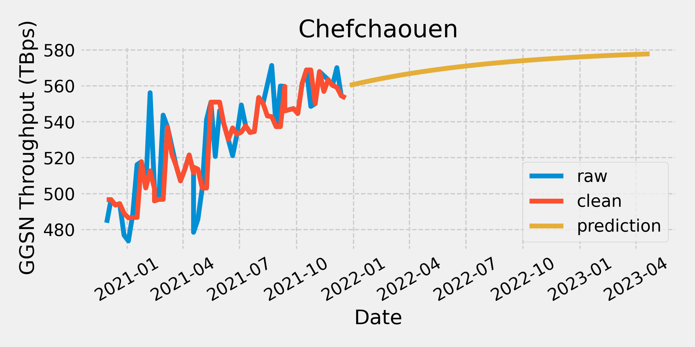

# GGSN Throughput Forecasting

**Disclaimer**: This repo is made for the purpose of showcasing data forecasting skill only. I modified the original dataset since it is confidential. Some fields were renamed and the values were transformed.

## Project Description
I was working on a GGSN (Gateway GPRS Support Node) throughput forecasting project for a network operator client. The goal is to predict future data traffic using historical data provided. While seasonal variations might be present, the main focus is on identifying long-term trends. This will help the client plan network capacity, optimize resource allocation, and proactively address potential bottlenecks. Through data analysis, model development, and evaluation, I created a forecasting solution that anticipates future GGSN throughput and empowers the client to make strategic network decisions.

## Technology
**Python 3.10.12**\
**Packages:** numpy, pandas, matplotlib, scipy, statsmodels, scikit-learn, prophet

## Results
| Method | Model | Avg MAPE | Var MAPE |
| -- | -- | -- | -- |
| Univariate | ARIMA | 0.065 | 0.002 |
| Univariate | ETS | 0.051 | 0.002 |
| Univariate | Prophet | 0.051 | 0.002 |
| Multivariate | ARIMA + OLS | 0.064 | 0.003 |
| Multivariate | ETS + OLS | 0.062 | 0.004 |
| Multivariate | Prophet + OLS | 0.060 | 0.005 |
| Ratio | ARIMA | 0.063 | 0.002 |
| **Ratio** | **ETS** | **0.049** | **0.002** |
| Ratio | Prophet | 0.058 | 0.002 |

